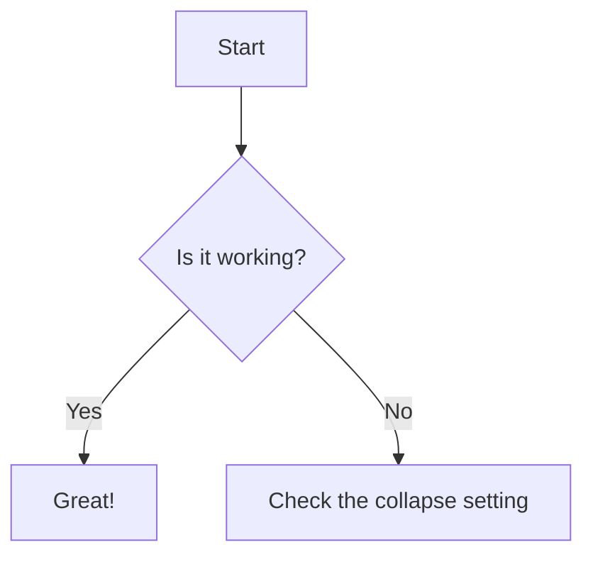
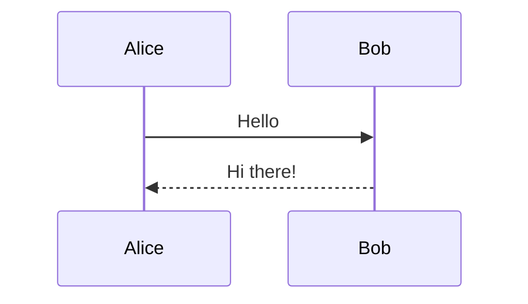
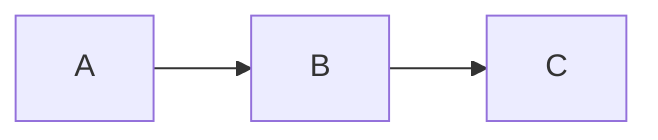
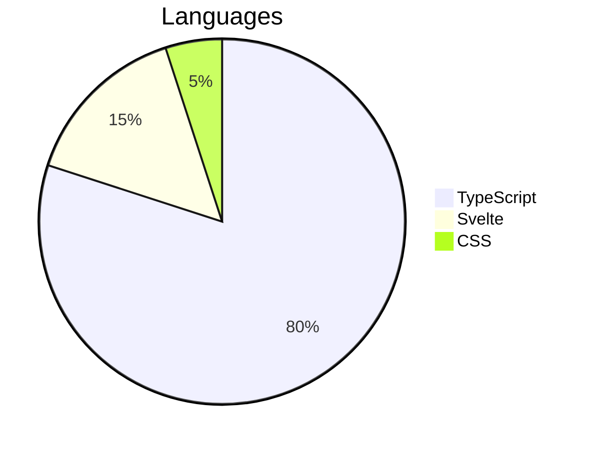

# Mermaid Diagrams

## All collapse states

### No collapse

````ad-note
title: Mermaid (non-collapsed)
No `collapse:` parameter.



````

---

### collapse: open

````ad-note
title: Mermaid (collapse: open)
collapse: open



````

---

### collapse: closed

The diagram renders after expanding the admonition.

````ad-warning
title: Mermaid (collapse: closed)
collapse: closed



````

---

### collapse: none

````ad-info
title: Mermaid (collapse: none)
collapse: none


````

---

## Mermaid + embeds

### Embed alone (baseline)

```ad-note
title: Embed without mermaid
![[embedded-content#Plain text section]]
```

---

### Mermaid and embed in the same admonition

````ad-note
title: Mermaid and embed together

![[embedded-content#Plain text section]]


````
